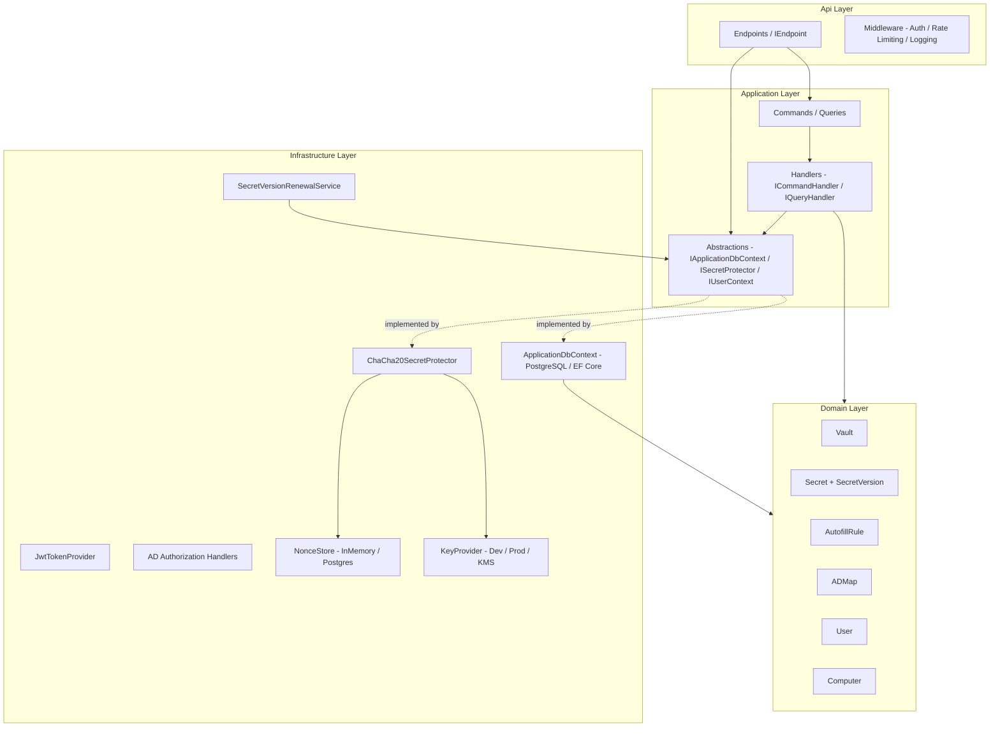

# Arquitetura em Camadas (Clean Architecture)

```mermaid
graph TD
    subgraph API["Api Layer"]
        EP[Endpoints / IEndpoint]
        MW[Middleware - Auth / Rate Limiting / Logging]
    end

    subgraph APP["Application Layer"]
        CMD[Commands / Queries]
        HDL[Handlers - ICommandHandler / IQueryHandler]
        ABS[Abstractions - IApplicationDbContext / ISecretProtector / IUserContext]
    end

    subgraph DOM["Domain Layer"]
        VAULT[Vault]
        SECRET[Secret + SecretVersion]
        RULE[AutofillRule]
        ADMAP[ADMap]
        USER[User]
        COMPUTER[Computer]
    end

    subgraph INFRA["Infrastructure Layer"]
        DB[ApplicationDbContext - PostgreSQL / EF Core]
        CRYPTO[ChaCha20SecretProtector]
        JWT[JwtTokenProvider]
        AD[AD Authorization Handlers]
        BG[SecretVersionRenewalService]
        NONCE[NonceStore - InMemory / Postgres]
        KEY[KeyProvider - Dev / Prod / KMS]
    end

    EP --> CMD
    EP --> ABS
    CMD --> HDL
    HDL --> ABS
    HDL --> DOM
    ABS -.->|implemented by| DB
    ABS -.->|implemented by| CRYPTO
    DB --> DOM
    CRYPTO --> KEY
    CRYPTO --> NONCE
    BG --> ABS
```
