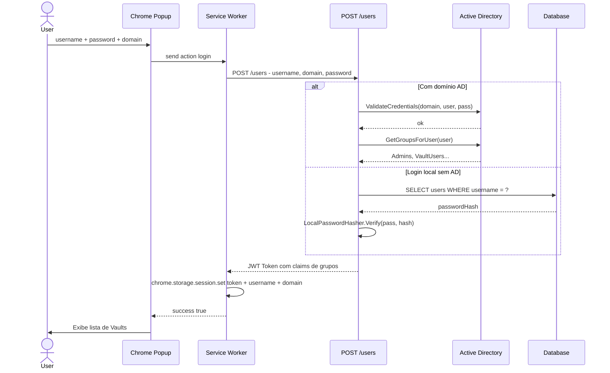

# Fluxo de Autenticação

```mermaid
sequenceDiagram
    actor User
    participant Popup as Chrome Popup
    participant SW as Service Worker
    participant API as POST /users
    participant AD as Active Directory
    participant DB as Database

    User->>Popup: username + password + domain
    Popup->>SW: send action login
    SW->>API: POST /users - username, domain, password

    alt Com domínio AD
        API->>AD: ValidateCredentials(domain, user, pass)
        AD-->>API: ok
        API->>AD: GetGroupsForUser(user)
        AD-->>API: Admins, VaultUsers...
    else Login local sem AD
        API->>DB: SELECT users WHERE username = ?
        DB-->>API: passwordHash
        API->>API: LocalPasswordHasher.Verify(pass, hash)
    end

    API-->>SW: JWT Token com claims de grupos
    SW->>SW: chrome.storage.session.set token + username + domain
    SW-->>Popup: success true
    Popup->>User: Exibe lista de Vaults
```
