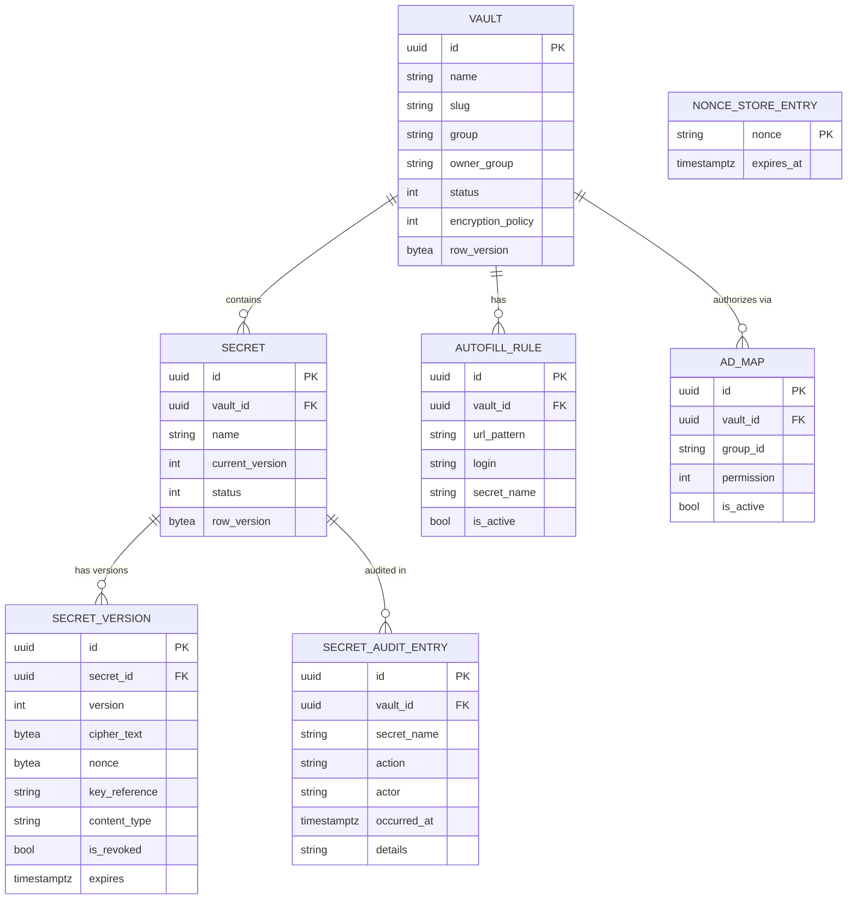

# Modelo de Domínio

```mermaid
erDiagram
    VAULT {
        uuid id PK
        string name
        string slug
        string group
        string owner_group
        int status
        int encryption_policy
        bytea row_version
    }
    SECRET {
        uuid id PK
        uuid vault_id FK
        string name
        int current_version
        int status
        bytea row_version
    }
    SECRET_VERSION {
        uuid id PK
        uuid secret_id FK
        int version
        bytea cipher_text
        bytea nonce
        string key_reference
        string content_type
        bool is_revoked
        timestamptz expires
    }
    AUTOFILL_RULE {
        uuid id PK
        uuid vault_id FK
        string url_pattern
        string login
        string secret_name
        bool is_active
    }
    AD_MAP {
        uuid id PK
        uuid vault_id FK
        string group_id
        int permission
        bool is_active
    }
    SECRET_AUDIT_ENTRY {
        uuid id PK
        uuid vault_id FK
        string secret_name
        string action
        string actor
        timestamptz occurred_at
        string details
    }
    NONCE_STORE_ENTRY {
        string nonce PK
        timestamptz expires_at
    }

    VAULT ||--o{ SECRET : "contains"
    VAULT ||--o{ AUTOFILL_RULE : "has"
    VAULT ||--o{ AD_MAP : "authorizes via"
    SECRET ||--o{ SECRET_VERSION : "has versions"
    SECRET ||--o{ SECRET_AUDIT_ENTRY : "audited in"
```
